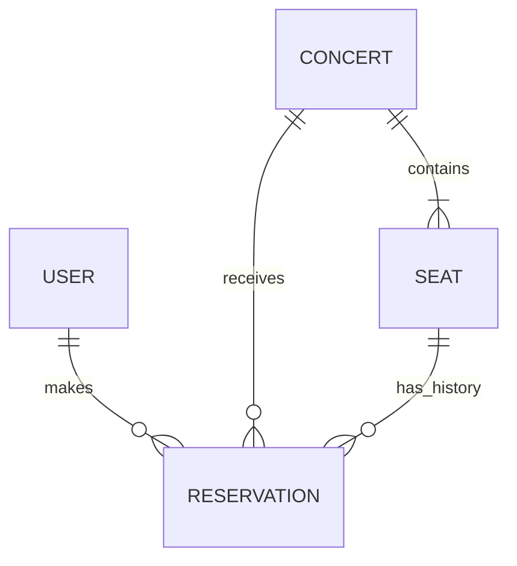

# 티켓팅 도메인 관계

## 1. 설계 범위

아이유 콘서트 1개, 공연 회차 1개, 지정 좌석 200석으로 시작한다. 사용자 한 명은 해당 공연에서 유효한 예매를 최대 1건 가질 수 있다.

이 문서는 최신 요구사항에 맞춘 도메인 설계다. 예매와 취소의 입력은 사용자 ID, 공연 ID, 좌석 ID이며, 기존 요구사항 문서의 예매 번호 기반 취소 API는 API 구현 시 이 입력 방식에 맞춰 조정한다.

공연 회차와 아티스트는 별도 도메인으로 분리하지 않는다. 현재 `Concert` 하나가 특정 일시에 열리는 공연 1회를 의미한다.

## 2. 도메인과 관계

| 도메인 | 역할 | 기본 속성 |
|---|---|---|
| 사용자 `User` | 예매의 소유자 식별 | 사용자 ID |
| 공연 `Concert` | 공연 정보와 시작 시각 관리 | 공연 ID, 공연명, 시작 일시 |
| 좌석 `Seat` | 공연에 속한 지정 좌석 식별 | 좌석 ID, 공연 ID, 좌석 번호 |
| 예매 `Reservation` | 사용자가 예매한 좌석과 예매 상태 관리 | 예매 ID, 사용자 ID, 공연 ID, 좌석 ID, 상태, 예매 일시, 취소 일시 |

- 공연 하나에는 좌석 200개가 속한다. 좌석 하나는 정확히 하나의 공연에 속한다.
- 좌석 번호는 공연 안에서 유일하다. 초기 번호는 1~200이다.
- 예매 하나는 사용자 한 명, 공연 하나, 좌석 하나를 참조한다.
- 예매의 공연 ID와 좌석이 속한 공연 ID는 반드시 같아야 한다.
- 사용자와 좌석은 취소 이력을 포함하면 여러 예매와 연결될 수 있다. 관계도의 다대일 관계는 이력을 포함한 관계다.
- 사용자 정보는 미리 등록된 테스트 사용자를 사용하며, 회원가입과 로그인은 이번 범위에 포함하지 않는다.

여기서 관계는 도메인 간 참조를 의미한다. JPA 양방향 연관관계나 자식 컬렉션을 모두 구현해야 한다는 의미는 아니다.

## 3. 저장할 값과 조회 시 계산할 값

예매 상태를 좌석 점유 여부의 기준으로 사용한다. 좌석에 별도의 예매 상태를 저장하지 않고, 공연에도 좌석 수 카운터를 저장하지 않는다.

| 조회 항목 | 판단 방법 |
|---|---|
| 총 좌석 수 | 해당 공연에 속한 좌석 수. 초기값은 200 |
| 잔여 좌석 수 | 총 좌석 수 − 해당 공연의 `CONFIRMED` 예매 수 |
| 좌석 예매 가능 여부 | 공연 시작 전이고, 해당 좌석의 `CONFIRMED` 예매가 없으면 가능 |

공연 시작 이후에는 빈 좌석이 남아 있어도 예매 가능 여부는 거짓이다. 잔여 좌석 수는 미예매 좌석 수를 의미하므로 0보다 클 수 있다.

취소 시 예매 상태를 `CANCELED`로 변경하면 해당 좌석은 점유가 해제된다. 따라서 공연 시작 전에는 다시 예매 가능한 상태로 조회된다. 좌석 상태와 잔여 좌석 수를 따로 갱신할 필요가 없다.

## 4. 예매 상태와 핵심 규칙

예매 생성 시 상태는 `CONFIRMED`이며, 취소하면 `CANCELED`로 변경한다. 취소된 예매는 삭제하지 않고 이력으로 남긴다. 재예매 시에는 새로운 예매를 생성한다.

- 같은 좌석의 `CONFIRMED` 예매는 최대 1건이다.
- 같은 사용자와 공연 조합의 `CONFIRMED` 예매는 최대 1건이다.
- 취소된 예매는 좌석 점유와 사용자별 예매 한도에 포함하지 않는다.
- 현재 시각이 공연 시작 일시보다 이른 경우에만 예매와 취소가 가능하다. 시작 시각과 정확히 같아도 거절한다.
- 다른 사용자의 예매는 조회하거나 취소할 수 없다. 테스트 단계에서는 전달된 사용자 ID를 요청 사용자로 간주한다.
- 동시 요청에서도 좌석 중복과 사용자별 한도 초과를 막아야 한다. 조회 후 저장만으로는 보장되지 않으며, DB 연동 단계에서 트랜잭션과 동시성 제어를 구현한다.

`(좌석 ID, 상태)`나 `(사용자 ID, 공연 ID, 상태)` 전체에 단순 유일 제약을 걸면 취소 이력을 여러 건 남길 수 없다. DB 제약 설계 시 유효한 예매에 대해서만 중복을 막는다는 점을 반영해야 한다.

## 5. 기능 흐름과 책임

### 예매

입력: 사용자 ID, 공연 ID, 좌석 ID.

1. 사용자와 공연이 존재하고, 좌석이 해당 공연에 속하는지 확인한다.
2. 공연 시작 전인지 확인한다.
3. 해당 사용자의 해당 공연 `CONFIRMED` 예매가 없는지 확인한다.
4. 해당 좌석의 `CONFIRMED` 예매가 없는지 확인한다.
5. `CONFIRMED` 예매를 생성하고 저장한다.

### 예매 조회

사용자 ID로 본인의 예매 목록을 조회한다. 확정·취소 상태와 공연 및 좌석 정보를 함께 제공한다. 취소 이력도 포함한다.

### 예매 취소

입력: 사용자 ID, 공연 ID, 좌석 ID.

1. 사용자, 공연, 해당 공연에 속한 좌석을 확인한다.
2. 공연 시작 전인지 확인한다.
3. 사용자 ID, 공연 ID, 좌석 ID가 모두 일치하는 `CONFIRMED` 예매를 찾는다.
4. 예매 상태를 `CANCELED`로 변경하고 취소 일시를 기록한다.
5. 동일 조합의 확정 예매가 없고 취소 이력만 있으면 이미 취소된 결과를 반환한다. 본인 예매 이력이 없으면 취소를 거절한다.

동일 좌석을 취소 후 다시 예매한 경우에는 현재 `CONFIRMED` 예매가 취소 대상이다. 세 ID만으로 요청하므로 과거 예매에 대한 취소 재시도와 현재 예매 취소를 구별하지 못한다. 이후 재시도까지 구분해야 한다면 예매 ID 기반 취소로 확장한다.

공연은 시작 시각에 따른 허용 여부를, 예매는 자신의 상태 변경을 담당한다. 여러 도메인을 조회하고 중복 여부를 확인하여 저장하는 과정은 애플리케이션 서비스가 하나의 트랜잭션으로 조정한다.

## 6. 첫 구현 목표와 테스트

첫 목표는 **사용자 한 명이 좌석 한 개를 예매하고 그 결과가 DB에 저장되는 것**이다.

1. 공연 시작 전, 등록된 사용자, 빈 좌석을 준비한 예매 성공 단위 테스트를 작성한다.
2. 테스트를 통과하도록 도메인 객체, 예매 서비스, 필요한 저장소 인터페이스를 구현한다.
3. 테이블 마이그레이션과 DB 저장소 구현을 추가한다.
4. MySQL 통합 테스트에서 저장 후 별도 조회로 사용자·공연·좌석 연결과 `CONFIRMED` 상태를 확인한다.

다음 단계에서 중복 좌석 예매, 사용자별 한도, 잘못된 대상, 시작 시각 경계, 본인 예매 조회, 취소 후 재예매를 테스트한다. 같은 좌석에 대한 동시 요청과 같은 사용자의 서로 다른 좌석에 대한 동시 요청도 각각 검증한다.

첫 성공 시나리오만 구현한 상태는 전체 예매 기능의 완료가 아니다. 중복 방지와 시간 제한, 조회·취소까지 검증한 뒤 요구사항 완료로 판단한다.

### 현재 구현 상태

- 첫 성공 단위 테스트를 작성하고, 예매 미구현으로 실패하는 것을 확인한 뒤 최소 구현으로 통과시켰다.
- 순수 Java 도메인, 저장소 인터페이스, `ReservationService`를 추가했다. 예매 ID는 UUID를 사용하며 예매 시각은 주입한 `Clock`으로 결정한다.
- 테스트는 메모리 저장소로 예매 1건의 저장과 사용자·공연·좌석 ID, `CONFIRMED` 상태, 예매 시각을 검증한다. Spring 컨텍스트와 DB는 사용하지 않는다.
- DB 저장, API, 좌석의 공연 소속 검증, 중복 예매·사용자별 한도·시작 시각 검증, 조회·취소는 아직 구현하지 않았다.
